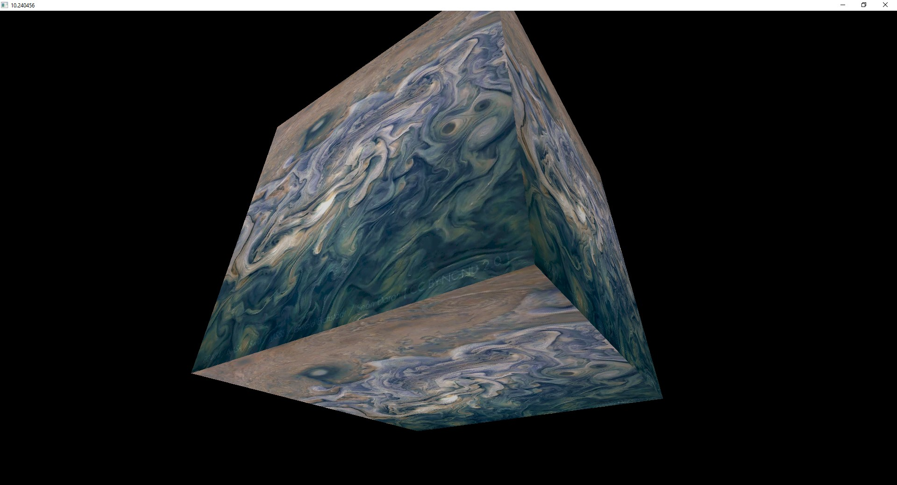
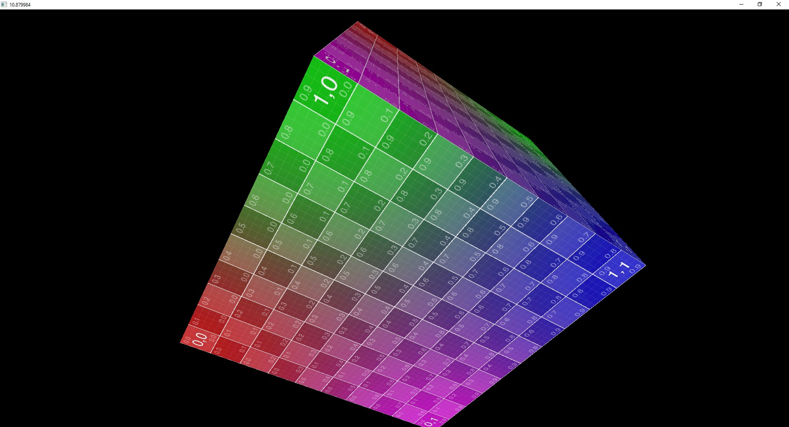

# Simple Software Rasterizer
It's an exercise to consolidate knowledge of homogeneous coordinates and rasterization algorithms.

This project is not intended to be the fastest and the best software renderer ever. If you need one please consider using [OpenSWR](https://www.openswr.org/) or [WARP](https://docs.microsoft.com/en-us/windows/win32/direct3darticles/directx-warp).

## How to run

There are two ways to do that: 

* Using a standalone command. Run `build-and-run.bat`.
* Using Visual Studio. To generate VS2019 solution run `gen-VS2019-x64.bat`. Then compile and run the app.

## Architecture:

There are only two modules:

* `librasterizer` is a static library that does most of the job.
* `host-gdi` is an executable that is in charge to create a window and output the result to it.

## Supported features

* Clipping in the homogeneous space (before perspective division).
* Perspective-correct interpolation of vertex attributes.
* Per-pixel lighting via Lambertian BRDF.

## Limitations

* GDI-based. `librasterizer` is OS-agnostic itself. But I had no much time to play with [SDL](https://www.libsdl.org/) or an alternative.
* No antialiasing.
* No mipmap levels.
* No texture filtering.
* The clipping process is serial, not parallel.
* After all, it's a simple thing.

## Third-Party libraries

The project uses [GLM library](https://github.com/g-truc/glm).