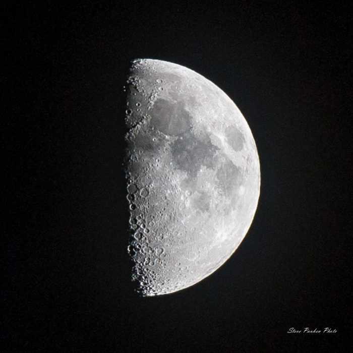

# Simple Software Rasterizer
It's an exercise to consolidate knowledge of homogeneous coordinates and rasterization algorithms.

This project is not intended to be the fastest and the best software renderer ever. If you need one please consider using [OpenSWR](https://www.openswr.org/) or [WARP](https://docs.microsoft.com/en-us/windows/win32/direct3darticles/directx-warp).

## How to run

There are three ways to do that: 

* Download the executable from [releases](https://github.com/tony-space/SimpleSoftwareRasterizer/releases).
* Using a standalone command. Run `build-and-run.bat`.
* Using Visual Studio. To generate VS2019 solution run `gen-VS2019-x64.bat`. Then compile and run the app.

## Architecture

There are only two modules:

* `librasterizer` is a static library that does most of the job.
* `host-gdi` is an executable that is in charge to create a window and output the result to it.

## Supported features

* Basic obj file support (enough to load the Stanford Bunny).
* Clipping in the homogeneous clip space (before perspective division).
* Tiled rasterization.
* Perspective-correct interpolation of vertex attributes.
* Per-pixel lighting via Lambertian BRDF.
* Gamma correction.

### Clipping

Clipping is a necessary step of any rasterization process.
The general misconception is the clipping is an optimization, but it's not actually.
The real goal of the clipping is preventing weird things from happening.

Firstly, objects behind the camera must not get projected on the screen:

*Image by Scratchapixel. [Source](https://www.scratchapixel.com/lessons/3d-basic-rendering/perspective-and-orthographic-projection-matrix/projection-matrices-what-you-need-to-know-first).*

Secondly, objects crossing the plane *w=0* must not wrap around:

*Image by J.F. Blinn and M.E. Newell. [Source](https://www.microsoft.com/en-us/research/wp-content/uploads/1978/01/p245-blinn.pdf)*

The clipping process works with a custom set of planes. The clipper may leave the triangle as is or chop it onto multiple triangles as follows:

The clipper is semi-parallel. It processes mesh triangles in parallel.
However, when it comes to emitting a new triangle, the clipper waits for a spin-lock.

### Tiled rasterization

A naive rasterizer takes a bounding box of a triangle and starts testing pixel coverage inside that box.
In the case of a thin but long triangle, most pixels fail the coverage test, so only a few of them perform rasterization.

Another problem is several triangles trying to cover the same pixel.
A naive rasterizer cannot process these triangles in parallel due to potential data race in depth and color buffers.

*Image by Nvidia. [Source](https://developer.nvidia.com/content/life-triangle-nvidias-logical-pipeline).*

Tiled rasterization is an optimization that increases the general level of parallelism. All triangles are scheduled to the tiles they cover. After the work assignment, these tiles start working parallel without sharing data, meaning there's no risk of a data race. Under the hood, the tiles are serial machines.

### Gamma correction

Gamma correction is essential when it comes to light computation. It gets done in linear space because the light is essentially linear.
However, monitors are non-linear. The generated image must be additionally post-processed before display.

*Left: gamma corrected image. Right: linear image.*

If you take a closer look at the real image of the Moon, you'll see how sharp the [terminator](https://en.wikipedia.org/wiki/Terminator_(solar)) is. Check this out:

*The real image of the Moon. [Source](https://earthsky.org/moon-phases/is-it-a-quarter-or-a-half-moon).*

The gamma correction process makes the resulting image lighting is more realistic.

## Limitations

* GDI-based. `librasterizer` is OS-agnostic itself. But I had no much time to play with [SDL](https://www.libsdl.org/) or an alternative.
* No antialiasing.
* No mipmap levels.
* No texture filtering.
* After all, it's a simple thing.

## Third-Parties

The project uses [GLM library](https://github.com/g-truc/glm) and [the Stanford Bunny model](https://en.wikipedia.org/wiki/Stanford_bunny).